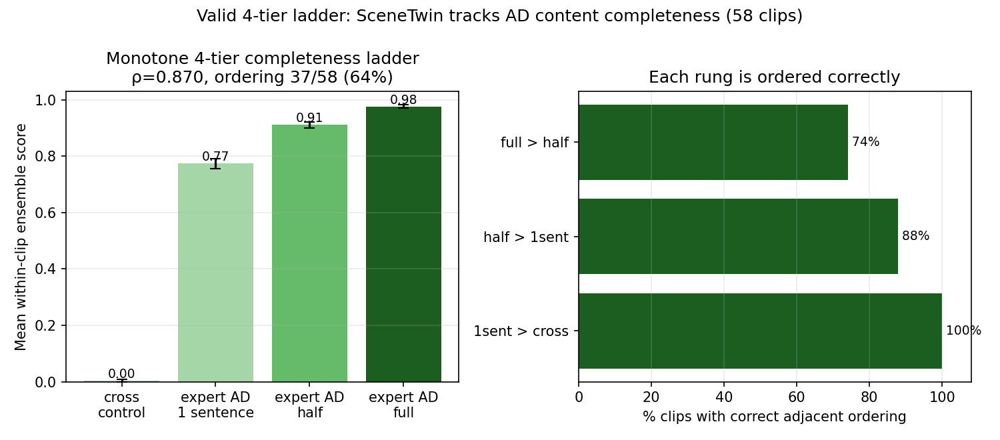

# A Valid 4-Tier Ladder: AD Content Completeness

The original 4th rung ("long VATEX") was the wordiest crowd caption — noise (see
[[findings/fake-tier-rung]]). This replaces it with a **principled, monotone-by-
construction** rung that tests SceneTwin's core claim: does it detect how much
visual content an audio description preserves?

```
tier0 cross control  <  expert AD (1 sentence)  <  expert AD (half)  <  expert AD (full)
```

Each rung is a strict superset of the visual content of the rung below it.
58 held-out VATEX clips. All four candidates graded blind by one model
(Gemini 2.5 Flash) against 10 frame-grounded questions spanning a granularity
gradient (4 core facts + 6 secondary visible details); CLIP top3 is local.

## Result

| Signal | ρ | full order | 
|--------|---:|-----------:|
| **Ensemble (50/50)** | **0.870** | **37/58 (64%)** |
| ADQA only | 0.770 | 21/58 |
| CLIP only | 0.636 | 17/58 |

Adjacent-rung ordering (ensemble):

| pair | correct |
|------|--------:|
| expert-full > expert-half | 74% |
| expert-half > 1-sentence | 88% |
| 1-sentence > cross control | 100% |

ADQA never inverts the top rung (`full ≥ half` on 100% of clips); the residual
top-rung difficulty is that half an expert AD already covers most essential
content, so the full-vs-half margin is small — CLIP grounding breaks those ties.



## Why this is a legitimate 4-tier (unlike the two we rejected)

- **Long-VATEX rung**: invalid — wordiest crowd caption, both signals at chance.
- **Machine-AD rung**: confounded — frame-grounding circularity + self-grading
  make machine AD tie/beat expert (`expert>machine` only 22%).
- **Completeness rung**: valid — monotone by construction, no circularity, and
  the ensemble lifts over both components (+0.10 over ADQA, +0.23 over CLIP),
  the same complementarity that holds on the main benchmark.

## Paper framing

SceneTwin resolves a four-level **content-completeness** ordering — unrelated
control < minimal AD < partial AD < complete AD — at ρ=0.87 out-of-distribution,
with the ensemble beating either signal alone. This demonstrates the metric
measures *essential visual-content coverage*, not verbosity (which is exactly why
the longest-crowd-caption rung was noise). The hardest distinction, full vs half
expert AD, is genuinely small because a competent AD front-loads essential content.

## See Also

- [[findings/fake-tier-rung]]
- [[findings/vatex60-generalization]]
- [[research/GROUND-UP-THESIS]]
