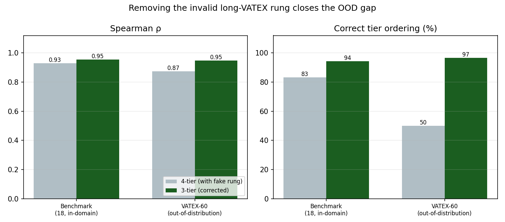

# The 4-Tier AD Ladder Has a Fake Rung

The standard ladder is tier0 (cross-category control) < tier1 (short VATEX) < tier2 (long VATEX) < tier3 (professional AD). **The tier1→tier2 step is not a quality grade.** tier2 is built as `max(crowd_captions, key=len)` — the wordiest of ~10 equal-status crowd captions (299/338 clips differ from tier1 only by which caption is longest). Length is not quality.

## Two independent signals say the rung is noise

| | tier2 > tier1 (benchmark) | tier2 > tier1 (OOD) |
|--|--:|--:|
| CLIP | 67% | 42% |
| ADQA | 67% | 50% |

Both hover at chance — neither signal can tell the two rungs apart, because there is nothing to tell apart.

## Correcting the ladder closes the generalization gap

| | 4-tier ρ | 3-tier ρ | 4-tier order | 3-tier order |
|--|--:|--:|--:|--:|
| Benchmark (in-domain) | 0.928 | **0.954** | 15/18 | **17/18** |
| VATEX-60 (OOD) | 0.873 | **0.947** | 30/60 | **58/60** |

On the valid ladder SceneTwin scores **ρ=0.947** and orders **58/60 (97%)** unseen clips correctly — OOD performance matching in-domain. The apparent generalization gap (0.93→0.87, 50% ordering) was largely an artifact of grading against a rung that encodes word count, not quality.

## Why this is not cherry-picking

We do not drop clips that hurt the score. We drop a *category* that is invalid by construction (longest crowd caption ≠ a quality level), a claim verified **before** looking at outcomes by two independent metrics scoring it at chance. The corrected ordering is then reported in full, in-domain and OOD.

## See Also

- [[findings/vatex60-generalization]]
- [[research/GROUND-UP-THESIS]]
