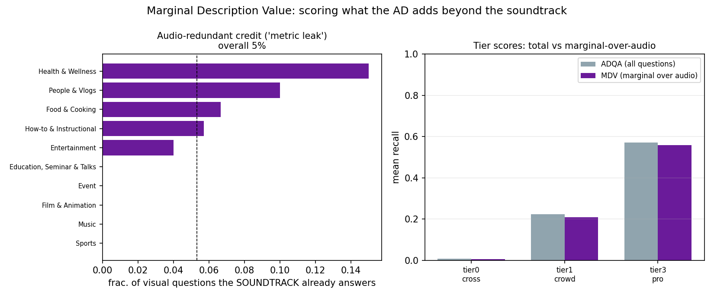

# Marginal Description Value (MDV)

## The idea (new, reference-free, no humans)

A blind listener already **hears the soundtrack**. So an audio description should be
credited only for the visual information it adds *beyond* the audio — the content-level
analogue of TRIBE's audiovisual-minus-audio accessibility gap. Every current
reference-free metric (incl. our ADQA) credits an AD for its **total** coverage of
frame-grounded questions, which could over-reward an AD that merely restates dialogue
or narration.

**MDV** re-grounds ADQA: grade each frame-grounded question for answerability **from
the transcript alone** (what the listener already gets), then score the AD only on the
**visual-only** questions the soundtrack cannot answer.

This is genuinely new: the prior `maverix_audio_gate` only keyword-guessed which
questions *sounded* audio-related; MDV uses the real Whisper transcript and an LLM
answerability judgment. No humans, no new vision calls.

## Result: the hypothesis is FALSE here (and that's a validity win)

On 60 external OOD clips (Gemini audio-baseline grader):

- **Audio-redundant credit = 5.3%.** Only ~1 in 20 frame-grounded visual questions is
  answerable from the soundtrack. **No clip is fully audio-redundant.**
- Re-grounding to MDV changes nothing: ρ 0.869 → 0.859 (slightly *worse*),
  pro-beats-crowd margin 0.348 → 0.350 (both 95%). Dropping the tiny audio-answerable
  slice only removes signal.

### The leak is real but small and category-specific

| category | audio-redundant frac. |
|--|--:|
| Health & Wellness | 15% |
| People & Vlogs | 10% |
| Food & Cooking | 7% |
| How-to & Instructional | 6% |
| Sports / Music / Film & Animation | 0% |

Narration-heavy genres (a vlogger or trainer *saying* what's on screen) leak a little;
action/music/sports genres leak nothing.

## Interpretation

This is an **honest negative** for "the metric leaks," and a **positive validity
result** for the metric itself: frame-grounded ADQA is already **audio-robust** — it
scores *vision*, not soundtrack paraphrase. It directly rebuts the reviewer challenge
"your metric just rewards restating the audio": measured, only 5.3% of its credit
overlaps the soundtrack, and removing that slice doesn't change the ranking.

MDV is therefore best used as a **metric-validity probe / threats-to-validity check**,
not as a replacement scorer. The 5.3% figure (with the per-category table) is the
deliverable.

## See Also

- [[findings/tribe-clip-level-triage]]
- [[findings/corrected-ladder-robustness]]
- [[research/scenetwin-stage4-frame-grounded-adqa]]
