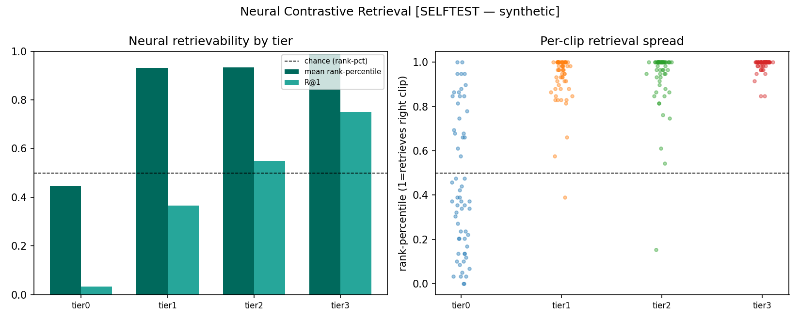

# Neural Contrastive Retrieval (NCR)

A genuinely new, AD-dependent, brain-grounded AD score designed to survive the two
confounds that killed every prior neural metric. **Results pending a Colab TRIBE run**;
the producer cell and analyzer are written and the analysis pipeline is verified.

## The idea

Feed each candidate AD's TEXT through TRIBE → the predicted brain response to *hearing*
the AD. Mean-pool to a vector `q`. For every clip's VIDEO brain response
`v_j = mean(P_AV_j)`, ask: among all 60 clips, does `q` retrieve the **right** one?

- **Score** = rank-percentile of the correct clip (1 = top, 0.5 = chance) and the
  cosine margin (self minus mean distractor).
- **Q1 quality ordering:** a better AD should make its clip more retrievable →
  rank-percentile rises `tier0 < tier1 < tier3`.
- **Q2 wrong-content control (the test neural closure FAILED):** `tier0_cross` is an AD
  copied from a *different* clip. Its `q` should retrieve its **source** clip, not this
  one → near chance. `tier3` should sit well above chance.

## Why it dodges the graveyard

Neural closure / Description Gain / MVRR all died because (a) **verbosity** inflated the
TRIBE perturbation and (b) AD **language injection** moved the response away from the
silent-video `P_AV`. NCR neutralizes both:

- **Cosine + rank are magnitude-invariant** → a uniformly wordier AD doesn't win; only
  *relative* retrieval matters.
- **Language injection becomes the signal, not the noise:** every AD injects language
  equally, so the only thing that retrieves clip *i* is clip-*i*-specific visual content.
  A vague/wrong AD injects language but points nowhere — which is exactly the
  wrong-content discrimination the absolute-distance metrics lacked.

NCR is also **AD-dependent** (varies per candidate), unlike the per-clip
`accessibility_gap` that mathematically cannot enter within-clip ρ.

## How to run

1. Colab: load TRIBE (existing notebook through Step 4), then paste and run
   `cursor/research/tribe_ncr_dump_cell.py`. ~300 TRIBE calls (~3–4h T4), npz-cached.
2. Download `ncr_similarity.csv` into `cursor/research/output/`.
3. Local: `python cursor/pipeline/neural_contrastive_retrieval.py` → JSON + chart +
   fills in the results below.

Validate the analyzer now without Colab: `--selftest` (synthetic; clearly labeled).

## Expected output shape (from the synthetic self-test — NOT a result)

A positive outcome looks like: `tier0` rank-pct ≈ chance, `tier3` ≫ chance,
ρ(tier, rank-pct) > 0, control p ≪ 0.05. If instead all tiers sit at chance, NCR is an
**honest negative** (60-way retrieval from mean-pooled, OOD-for-TRIBE text is too noisy)
and we report that — it does not get buried.

## Risk (stated up front)

TRIBE sees AD text via TTS→re-transcription (out-of-distribution vs natural movie
audio), and mean-pooling discards temporal structure. 60-way retrieval in 20484-dim
noisy space may land at chance. This is a real swing with real downside — but it is
*falsifiable* and structurally distinct from the dead branches.

## See Also

- [[findings/tribe-clip-level-triage]]
- [[research/scenetwin-description-gain-smoke-test]]
