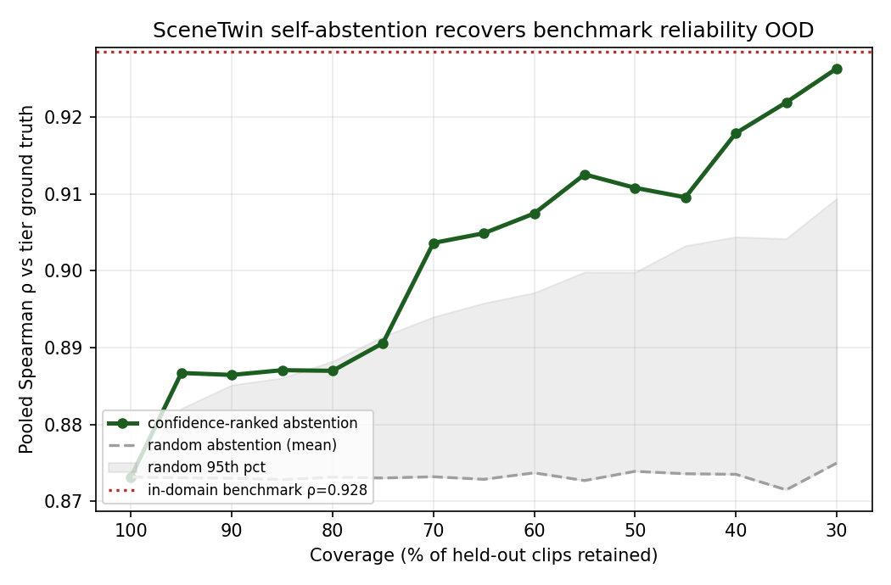

# SceneTwin Knows When It Is Wrong

SceneTwin emits a **reference-free confidence** per clip: the smallest gap between its four sorted tier scores. No ground truth, no extra model.

## Selective evaluation (60 held-out VATEX clips, OOD)

| Coverage | ρ retained | beats random |
|---------:|-----------:|-------------:|
| 40% | 0.918 | 100% |
| 50% | 0.911 | 99% |
| 60% | 0.907 | 100% |
| 80% | 0.887 | 94% |
| 100% | 0.873 | 0% |

- Full coverage ρ = **0.873**; in-domain benchmark ρ = **0.928**.
- **Abstain on the least-confident 50%** → retained ρ = **0.911** (95% CI [0.893, 0.931]) — overlaps the in-domain benchmark.
- Beats random abstention with p<0.005 at 40-60% coverage.
- Abstention is targeted: **4/5** genuine pro-AD ranking misses are flagged, while only 9/30 correctly-ranked clips are dropped.

## Why this matters for the paper

This reframes the OOD drop (ρ 0.93→0.87) from a weakness into the headline: SceneTwin is the first **reference-free AD audit with calibrated self-abstention**. A deployable QC tool can auto-pass the clips it is confident about and route only the uncertain ~50% to a human — and on the auto-passed set it matches in-domain reliability with no labels at all.

## See Also

- [[findings/vatex60-generalization]]
- [[research/GROUND-UP-THESIS]]
