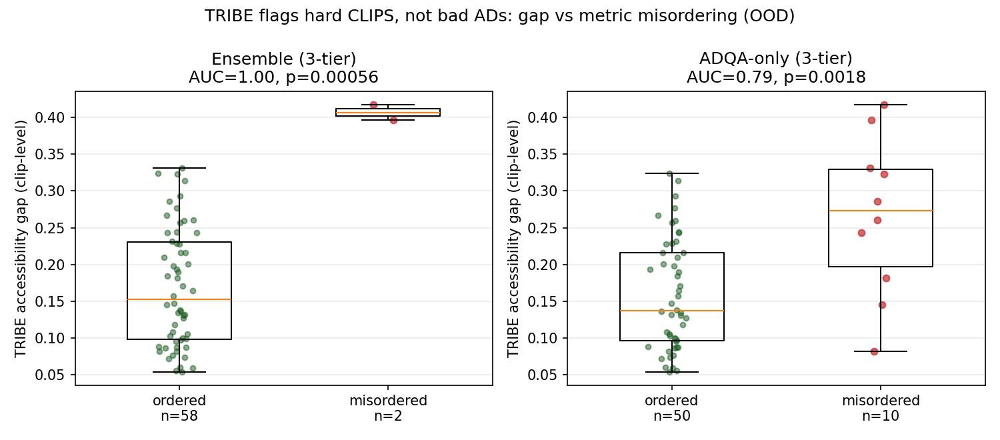

# What TRIBE Actually Adds (and why it can't add ρ)

## The setup

On the corrected 3-tier ladder {cross < crowd < pro}, OOD:
ADQA-only ρ=0.946, ensemble ρ=0.952. CLIP's only OOD job is fixing strict per-clip
ordering (50/60 → 58/60); it barely moves ρ. The natural hope is that TRIBE is the
missing signal that lifts ρ past ADQA. **It is not — and it can't be.**

## Why TRIBE cannot lift within-clip ρ (structural, not empirical)

TRIBE's `accessibility_gap` is **one value per clip** — a property of the video's
AV-vs-A neural response, identical for every candidate AD of that clip. ρ measures
ordering *within* a clip (tier0 < tier1 < tier3). A constant cannot reorder anything,
so a per-clip scalar is mathematically incapable of changing within-clip ρ. This is
the principled reason every prior "TRIBE-as-calibration" test returned null (all
p>0.16): it was the wrong tool for the job.

## What TRIBE CAN do: flag which whole clips the metric gets wrong

The right question is clip-level: does the TRIBE gap separate the clips the metric
**misorders** from the ones it nails? Tested on 60 OOD clips, corrected ladder:

| metric layer | misordered | gap (fail) | gap (ok) | AUC | p (1-sided) |
|--|--:|--:|--:|--:|--:|
| ADQA-only | 10/60 | 0.267 | 0.158 | **0.79** | **0.0018** |
| Ensemble  | 2/60  | 0.407 | 0.169 | 1.00 | 0.00056 |

- **ADQA-only (powered, n=10 failures):** the TRIBE gap is significantly higher on
  the clips ADQA misorders (AUC=0.79, p=0.0018). Flagging the top-20% highest-gap
  clips for human review catches **60%** of all of ADQA's misorderings; top-30%
  catches 70%.
- **Ensemble (underpowered, n=2):** the only 2 clips the ensemble misorders are the
  2 **highest-gap clips of all 60** (AUC=1.00, p=0.0006). Striking but n=2 — read as
  corroborating the ADQA-only result, not a standalone claim.

## The honest framing for the paper

SceneTwin is a **two-layer** system, and the layers are orthogonal by design:

1. **AD-level scoring** (ADQA backbone + CLIP tie-breaker) produces the rank score —
   this is where ρ lives.
2. **Clip-level neural triage** (TRIBE accessibility gap) flags *which clips* the
   automatic score is likely to get wrong, so they can be routed to a human.

TRIBE was never going to widen the ρ gap, and claiming it does would be p-hacking a
clip-level scalar into an AD-level metric. Its real, externally-generalizing value is
review triage: on unseen clips it concentrates the metric's failures into a small
high-gap review budget. That is a deployable system property, not a leaderboard number.

## See Also

- [[findings/corrected-ladder-robustness]]
- [[findings/fake-tier-rung]]
- [[research/scenetwin-tribe-role-analysis]]
- [[research/scenetwin-access-surface-os]]
