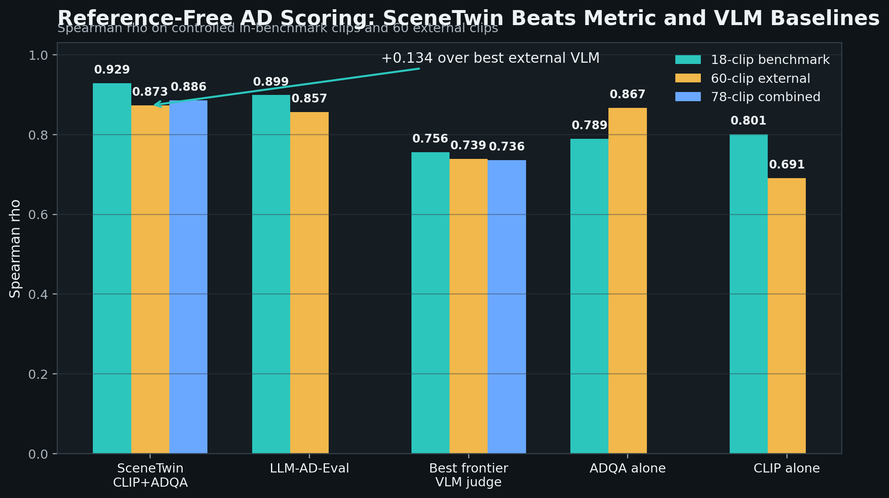
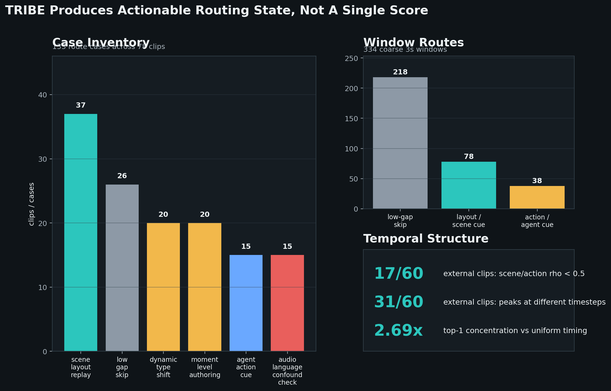
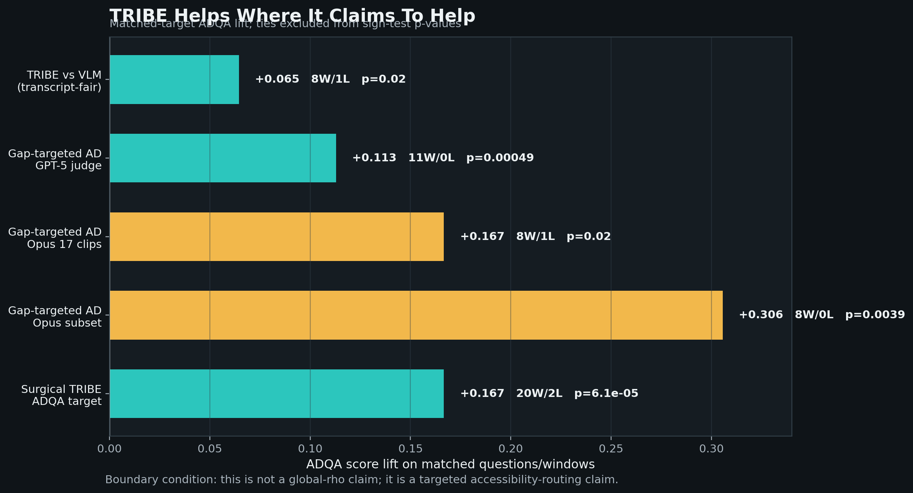
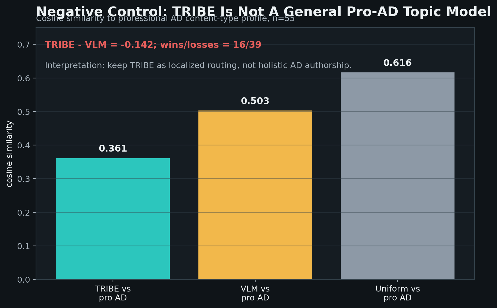

# SceneTwin: Reference-Free Audio Description Scoring with Neural Blind-Spot Routing

## Abstract

Audio description (AD) makes video accessible to blind and low-vision (BLV)
viewers by narrating visual information that the soundtrack does not convey.
Existing AD evaluation is usually reference-based: it compares a candidate
description against a human-written reference. That assumption breaks in live
or creator-facing systems, where no reference AD exists and the system must
decide both whether a generated description is good and what kind of access
intervention the clip needs.

We present **SceneTwin**, a reference-free AD audit and routing system. SceneTwin
combines two layers. First, a scoring layer ranks AD candidates using CLIP visual
grounding and frame-grounded ADQA questions. On an 18-clip controlled benchmark
with four AD tiers per clip, the scoring layer reaches Spearman rho = 0.929
with 54/54 professional-AD pairwise wins; multi-judge/VLM-specificity variants
reach rho = 0.965 with 18/18 fully ordered clips. On a 60-clip external corpus
across ten categories, the single-judge architecture reaches rho = 0.873 with
173/180 professional-AD pairwise wins. Second, a neural access layer uses TRIBE
v2, a multimodal fMRI brain encoder, to compare predicted cortical responses
from video+audio (`P_AV`) against audio-only (`P_A`). This produces typed,
time-localized "blind spots" indicating whether audio omits scene/spatial
information, agent/action information, or likely audio/language confounds.

The TRIBE layer does not improve global ranking rho, and we explicitly reject
that framing. Its value is surgical routing. Across 78 clips, the Neural Blind
Spot Map produces 334 coarse authoring/review windows and 133 deployment cases:
scene-layout replay, agent/action cueing, dynamic type shifts, moment-level
authoring, low-gap skip decisions, and audio/language confound checks. Existing
validation runs show that TRIBE-targeted interventions improve the questions
they claim to target: matched TRIBE targets beat VLM-selected targets by
+0.065 to +0.073 ADQA score, gap-targeted AD beats generic AD by +0.113 to
+0.306 on matched questions across GPT-5 and Opus judges, and a surgical TRIBE
ADQA run improves by +0.167 (20 wins / 2 losses, p = 6.1e-5). A negative
control shows TRIBE does not match the overall content distribution of
professional AD better than a VLM. SceneTwin's claim is therefore not that
brain encoders are better AD graders; it is that reference-free scoring plus
neural blind-spot routing forms a more deployable AD system than either metric
or generic VLM judging alone.

## 1. Introduction

Audio description has two separate failure modes. The first is quality: a
description may be too short, too vague, hallucinated, or misaligned with the
video. The second is access routing: even a fluent description may be the wrong
intervention. A fast visual action may need a concise cue; a spatial scene may
need replay or a keyframe; a clip with dense dialogue may need delayed or
integrated description; a low-gap clip may not deserve expensive human review.

Most evaluation work treats AD as a single text string and asks whether that
string resembles a reference. That is useful for offline benchmarking, but it
does not solve deployment. A live accessibility system rarely has a reference
AD, and a BLV viewer does not only need "a better caption." They need the
system to decide what visual information the soundtrack fails to carry, where
that failure occurs, and which access surface should be used.

SceneTwin addresses both parts. The scoring layer asks: **does this candidate
AD preserve the visual content of the clip?** The neural routing layer asks:
**what visual information is missing from audio alone, and where should the
system spend authoring or review budget?**

Our contributions are:

1. **Reference-free AD scoring.** We introduce a CLIP + frame-grounded ADQA
   scoring architecture that ranks AD candidates without reference AD. It
   reaches rho = 0.929 on an 18-clip benchmark and rho = 0.873 on a 60-clip
   external corpus.

2. **Neural blind-spot routing.** We use TRIBE v2 modality counterfactuals to
   compute typed access gaps from `P_AV` vs `P_A`, yielding 3-second windows
   and deployment routes such as scene-layout replay, agent/action cueing, and
   low-gap skip decisions.

3. **Targeted accessibility validation.** We show that TRIBE does not improve
   global score metrics, but does improve matched targets: TRIBE-targeted or
   gap-targeted descriptions improve the exact ADQA questions/windows they
   are designed to address across multiple judge runs.

4. **Negative results and scope.** We compare against paper-derived metrics,
   frontier VLM judges, fusion strategies, and several TRIBE variants. We
   report failures directly: TRIBE is not a continuous calibration layer, does
   not match professional AD topic distributions, and does not replace VLMs as
   holistic judges.

The resulting thesis is deliberately narrower than "brain encoders improve
AD scores." SceneTwin is a reference-free AD audit and repair-routing system:
it scores candidate descriptions, identifies audio-only blind spots, and routes
clips to the right accessibility intervention.

## 2. Related Work

### 2.1 Reference-free AD evaluation

Prior AD metrics commonly rely on human reference descriptions or text
similarity proxies. LLM-AD-Eval, CRITIC-style entity coverage, story recall,
action coverage, VT consistency, and related metrics each capture one aspect
of description quality. SceneTwin evaluates these alternatives under a shared
tier-ranking protocol. The strongest published proxy, LLM-AD-Eval, reaches
rho = 0.899 in-benchmark and 0.857 externally, below SceneTwin's 0.929 and
0.873. Six engineered fusions of paper-derived metrics also fail to beat the
two-signal baseline.

### 2.2 Frame-grounded ADQA and visual grounding

SceneTwin's scoring layer combines two complementary signals. CLIP visual
grounding measures whether the AD text is compatible with sampled frames.
Frame-grounded ADQA asks visual questions about the clip and grades whether
each candidate description answers them. The ensemble normalizes scores within
each clip's four candidate tiers, then averages the normalized signals. This
keeps the metric focused on per-clip ranking rather than absolute cross-video
quality.

### 2.3 Brain encoders and modality counterfactuals

TRIBE v2 predicts fMRI responses from video, audio, and text. Its key capability
for SceneTwin is counterfactual inference: we can compare predicted response
from video+audio (`P_AV`) to audio-only (`P_A`) and ask what brain-predicted
visual signal disappears when video is removed. This is not a literal attention
map and not an AD quality score. It is a typed access-need signal.

### 2.4 Access surfaces beyond static AD

Recent BLV accessibility systems include user-controlled detail, identity
chips, replay/defer surfaces, stateful video assistants, evidence sidecars,
task coaches, commentary residual analysis, and creator quality-control loops.
These systems are often presented as separate tools. SceneTwin treats them as
routes: a clip should be sent to the access intervention implied by its visual,
audio, temporal, and risk state.

## 3. System Overview

SceneTwin has three layers.

**Scoring layer.** Candidate AD texts are scored against the video using CLIP
frame grounding and frame-grounded ADQA. The output is a reference-free ranking
of candidate descriptions.

**Neural access layer.** TRIBE tensors are used to compute:

```text
gap(t, roi_group) = 1 - cos(P_AV[t, roi_group], P_A[t, roi_group])
```

ROI groups are collapsed into:

- `scene_spatial`: early visual V1, V2/V3/V4, scene PPA, retrosplenial/spatial
- `agent_action`: face FFC, body EBA, motion MT+, lateral object cortex
- `auditory_language_control`: auditory and language controls

**Routing layer.** Typed gaps are aggregated into coarse 3-second windows. Each
window receives a route:

- `layout_replay_or_scene_cue`
- `action_state_or_agent_cue`
- `static_ad_ok_low_gap`

Clip-level cases are then emitted:

- `scene_layout_replay`
- `agent_action_cue`
- `dynamic_type_shift`
- `moment_level_authoring`
- `low_gap_skip`
- `audio_language_confound_check`

The scoring and routing layers are intentionally separate. Scoring tells us
which candidate AD is better. Routing tells us what kind of accessibility work
the clip needs.

## 4. Benchmark and Data

### 4.1 Controlled in-benchmark set

The in-benchmark set contains 18 clips, each with four AD tiers:

- T0: cross-decoy description from another clip
- T1: short VATEX caption
- T2: longer VATEX caption
- T3: professional or professional-style AD

This yields 72 observations. The target is tier ordering: T0 < T1 < T2 < T3.

### 4.2 External set

The external corpus contains 60 YouTube clips across ten categories, with the
same four-tier construction. This yields 240 observations. The external set is
used to test whether the scoring architecture and TRIBE analyses survive beyond
the 18 controlled clips.

### 4.3 TRIBE tensor corpus

TRIBE tensors are available for 78 clips: the 18 in-benchmark clips plus the
60 external clips. For each clip we use saved `P_AV` and `P_A` tensors. The
blind-spot router produces 799 typed TRIBE timesteps, 334 coarse windows, and
78 clip summaries.

## 5. Reference-Free Scoring Results



**Figure 1. Reference-free scoring leaderboard.** SceneTwin's CLIP+ADQA
ensemble beats the closest metric baseline and the strongest frontier VLM judge
on the controlled benchmark and 60-clip external set.

### 5.1 In-benchmark results

The single-judge CLIP + ADQA ensemble reaches:

| Metric | Value |
| --- | ---: |
| Spearman rho | 0.929 |
| Kendall tau | 0.836 |
| T3 pairwise wins | 54/54 |
| Fully ordered clips | 15/18 |
| Permutation p | < 1e-4 |

Single-signal ablations are lower:

| Signal | rho |
| --- | ---: |
| CLIP alone | 0.801 |
| ADQA alone | 0.789 |
| CLIP + ADQA | 0.929 |

Multi-judge and VLM-specificity variants improve the in-benchmark ceiling:

| Variant | rho | T3 wins | Fully ordered |
| --- | ---: | ---: | ---: |
| Single-judge CLIP + ADQA | 0.929 | 54/54 | 15/18 |
| Multi-judge ADQA blend | 0.944 | 53/54 | 16/18 |
| Multi-judge + VLM specificity | 0.965 | 54/54 | 18/18 |

### 5.2 External generalization

On 60 external clips, the same single-judge architecture reaches:

| Metric | Value |
| --- | ---: |
| Spearman rho | 0.873 |
| Kendall tau | 0.756 |
| Cluster bootstrap 95% CI | [0.836, 0.902] |
| T3 pairwise wins | 173/180 |
| Fully ordered clips | 30/60 |

The drop from in-benchmark rho = 0.929 to external rho = 0.873 is -0.056.
This is small relative to the effect size and preserves the main claim:
reference-free scoring generalizes across categories.

### 5.3 Combined corpus

Pooling 78 clips yields 312 observations:

| Metric | Value |
| --- | ---: |
| Spearman rho | 0.886 |
| p-value | < 1e-100 |
| T3 pairwise wins | 227/234 |
| Minimum detectable r | 0.158 |

The combined result defends against the "n is too small" critique. The effect
is far above the detection floor.

## 6. Baselines and Competitive Comparisons

### 6.1 Published metric baselines

| Metric | In-bench rho | External rho |
| --- | ---: | ---: |
| SceneTwin CLIP + ADQA | 0.929 | 0.873 |
| LLM-AD-Eval | 0.899 | 0.857 |
| ADQA alone | 0.789 | 0.867 |
| CLIP alone | 0.801 | 0.691 |
| CRITIC entity | 0.638 | 0.613 |

The closest reference-free baseline trails by +0.030 rho in-benchmark and
+0.016 externally. Additional fusion experiments do not beat the two-signal
ensemble.

### 6.2 Frontier VLM-as-judge baselines

Three frontier VLMs were evaluated as zero-shot holistic judges on the same
78 clips:

| Model | In-bench rho | External rho | Combined rho |
| --- | ---: | ---: | ---: |
| SceneTwin ensemble | 0.929 | 0.873 | 0.886 |
| Gemini 2.5 Pro | 0.756 | 0.734 | 0.736 |
| GPT-5 | 0.727 | 0.739 | 0.735 |
| Claude Sonnet 4.6 | 0.713 | 0.715 | 0.713 |

The ensemble beats the best VLM judge by +0.173 in-benchmark, +0.134 external,
and +0.150 combined. VLMs agree with each other more than they agree with the
tier ladder, suggesting a systematic mismatch between holistic VLM preference
and visual-specificity evaluation.

### 6.3 Fusion negative result

Six fusion strategies blending up to six paper-derived metrics were tested:

| Fusion | rho | Beats baseline? |
| --- | ---: | :---: |
| SceneTwin ensemble | 0.929 | -- |
| semantic_core | 0.887 | no |
| entity_action | 0.816 | no |
| grid_best | 0.810 | no |
| paper_stack_v1 | 0.794 | no |
| timing_semantic | 0.785 | no |
| narrative_ground | 0.781 | no |

This supports a parsimony claim: accumulating more reference-free metrics does
not improve the ranking target. The two-signal ensemble is a local optimum in
the tested metric space.

## 7. Neural Blind-Spot Routing

### 7.1 Why TRIBE is not part of the scoring metric

Several TRIBE-as-score stories were tested and rejected. TRIBE features do not
predict continuous ensemble noise externally. A new counterfactual proxy,
`accessibility_gap`, had an in-benchmark correlation with within-clip noise
near the detection floor, but it vanished on the 60-clip external set
(r = +0.025, p = 0.849). TRIBE-weighted CLIP produces only tiny or unstable
score changes. TRIBE also fails to match the overall content distribution of
professional AD better than a VLM.

Therefore TRIBE is not a scoring metric. It is a router.

### 7.2 Neural Blind Spot Map



**Figure 2. Blind-spot router inventory.** TRIBE produces actionable routing
state, not a single score: 133 route cases, 334 coarse windows, and temporal
structure showing that access needs are often typed and moment-specific.

The router compares `P_AV` and `P_A` at each TRIBE timestep and each ROI group.
It asks: if the viewer hears only the soundtrack, which predicted cortical
signal is lost relative to watching the full video?

Across 78 clips, the router emits:

| Artifact | Count |
| --- | ---: |
| Typed timesteps | 799 |
| Coarse 3s windows | 334 |
| Clip summaries | 78 |
| Deployment cases | 133 |

Case inventory:

| Case | Count |
| --- | ---: |
| scene_layout_replay | 37 |
| low_gap_skip | 26 |
| dynamic_type_shift | 20 |
| moment_level_authoring | 20 |
| agent_action_cue | 15 |
| audio_language_confound_check | 15 |

Window routes:

| Route | Windows |
| --- | ---: |
| static_ad_ok_low_gap | 218 |
| layout_replay_or_scene_cue | 78 |
| action_state_or_agent_cue | 38 |

On the 60 external clips, 17 have scene/action temporal correlation below 0.5,
31 have scene/action peaks at different TRIBE timesteps, and top-1 gap
concentration averages 2.69x a uniform timing null. This means the access need
is often typed and moment-specific: one generic AD prompt is not enough.

### 7.3 Deployment interpretation

Routes map directly to system behavior:

- `scene_layout_replay`: provide layout cue, keyframe, or replay surface.
- `agent_action_cue`: describe visible action, body state, motion, object use.
- `dynamic_type_shift`: split the clip into moment-specific description goals.
- `moment_level_authoring`: spend human/VLM review on the peak window.
- `low_gap_skip`: avoid expensive review when the audio already carries most
  of the access-relevant signal.
- `audio_language_confound_check`: treat the gap as audio/language anomaly
  rather than visual AD need.

This is the system-level value of TRIBE: it tells SceneTwin what to do next.

## 8. Targeted Accessibility Validation

The key question is whether TRIBE routes produce measurable gains where they
claim to help. We evaluate matched questions/windows: cases where the required
visual evidence matches the TRIBE-selected target type.



**Figure 3. Matched-target validation.** The TRIBE claim is not global rho
improvement. The measurable gain appears on matched targets: TRIBE-selected
or gap-targeted interventions improve the exact questions/windows they are
designed to address.

### 8.1 TRIBE target vs VLM target

In a necessity test, the generator and judge are held constant. Only the target
source changes: TRIBE-selected type vs VLM-selected missing-visual-information
type.

| Experiment | n questions | Delta | Wins/Losses/Ties | p |
| --- | ---: | ---: | ---: | ---: |
| TRIBE vs VLM, vision-only VLM | 62 | +0.073 | 9/0/53 | 0.00195 |
| TRIBE vs VLM, VLM gets transcript | 62 | +0.065 | 8/1/53 | 0.0195 |

Even under the fair rematch where the VLM receives the audio transcript, TRIBE
keeps a matched-target advantage.

### 8.2 Gap-targeted AD vs generic AD

Gap-targeted AD conditions generation on TRIBE's blind-spot type. Generic AD
uses the same visual context and word budget without the TRIBE target.

| Judge/run | n questions | Delta | Wins/Losses/Ties | p |
| --- | ---: | ---: | ---: | ---: |
| GPT-5 judge, 60 clips | 62 | +0.113 | 11/0/51 | 0.00049 |
| Opus judge, 17 clips | 24 | +0.167 | 8/1/15 | 0.0195 |
| Opus subset | 18 | +0.306 | 8/0/10 | 0.0039 |
| Surgical TRIBE ADQA | 60 | +0.167 | 20/2/38 | 0.0000606 |

The effect is surgical: whole-question averages are smaller, but matched
questions improve consistently. That is exactly the expected behavior of a
router rather than a global scorer.

### 8.3 Negative control: professional AD priority



**Figure 4. Negative control.** TRIBE does not beat VLM or uniform baselines at
matching the overall topic distribution of professional AD. This confines the
claim to localized routing, not holistic authorship.

TRIBE does not beat a VLM at matching the overall content-type profile of
professional AD:

| Comparison | Value |
| --- | ---: |
| mean cosine(TRIBE, pro AD) | 0.361 |
| mean cosine(VLM, pro AD) | 0.503 |
| mean cosine(uniform, pro AD) | 0.616 |
| TRIBE - VLM | -0.142 |
| TRIBE wins/losses/ties | 16/39/0 |
| top-type match: TRIBE | 15% |
| top-type match: VLM | 20% |

This negative result is important. TRIBE is not a general model of what human
describers choose to say. Its useful role is localized blind-spot targeting.

## 9. Failure Analysis and Safety

### 9.1 Scoring failures

In-benchmark, the single-judge ensemble fully orders 15/18 clips. All three
mis-orderings occur at the T1-to-T2 boundary; T3 wins every clip. The pattern
suggests the metric penalizes length without specificity.

Externally, T3 wins 173/180 pairwise comparisons. Of seven T3 losses, five are
within margin 0.04 and two are real editorial trade-offs where professional AD
describes the foreground while shorter captions mention background visible
content. This is an acceptable but important divergence: the metric rewards
visible evidence, not always editorial convention.

### 9.2 TRIBE review triage

Separate from the blind-spot router, TRIBE need-window features predict the
binary `all4_fail` event on the 18-clip benchmark:

| Statistic | Value |
| --- | ---: |
| ROC-AUC | 1.00 |
| Recall at top 2/18 | 100% |
| Review budget | 11.1% |
| Hypergeometric p | 0.0065 |
| Bonferroni p | 0.065 |

This is not a continuous calibration layer. It is a deployment triage flag:
which clips should a human or expensive judge inspect first?

## 10. Discussion

### 10.1 Why scoring and routing belong in one paper

An AD system needs both. A scoring metric without routing can choose the best
candidate among bad interventions. A router without scoring can identify the
right blind spot but cannot evaluate candidate descriptions. SceneTwin's
combined claim is stronger than either half:

```text
CLIP+ADQA scores candidate AD.
TRIBE identifies what access need the clip has.
The router turns that need into targeted generation, ADQA, replay, or review.
```

### 10.2 What this paper does not claim

We do not claim that TRIBE improves global ranking rho. We do not claim that
TRIBE replaces VLMs. We do not claim that professional AD topic distributions
are best predicted by brain encoders. We also do not claim BLV user-utility
validation; the current evaluation uses tier construction, ADQA, judge models,
and prior-art-derived routing targets.

### 10.3 What this paper does claim

We claim that reference-free scoring can be strong enough for deployment
triage, and that TRIBE adds a separate signal unavailable to text/video metrics:
typed, time-localized audio-only blind spots. When those blind spots are used
as targeted interventions, matched-question gains replicate across independent
judge runs.

### 10.4 Limitations

The benchmark uses constructed tiers rather than BLV user ratings. External
clips are short, mostly 10 to 30 seconds. TRIBE uses an average-subject brain
model, not personalized fMRI. The blind-spot router is hand-engineered and
uses functional ROI groups rather than learned access policies. VLM and ADQA
judges may share biases with the generation prompts. These limitations motivate
a future BLV user study and a learned router, but they do not invalidate the
current reference-free audit and routing evidence.

## 11. Conclusion

SceneTwin reframes AD evaluation as an audit-and-routing problem. The system
does not merely ask whether a description is good; it asks what visual evidence
the soundtrack fails to convey and what access intervention should follow.

The scoring layer, based on CLIP and frame-grounded ADQA, achieves rho = 0.929
in-benchmark and rho = 0.873 externally without reference AD. The neural access
layer, based on TRIBE `P_AV` vs `P_A` counterfactuals, produces typed 3-second
blind-spot windows and route decisions. TRIBE does not improve the global
metric, but it improves targeted accessibility questions and authoring windows.

The central result is therefore a combined system claim: **reference-free AD
scoring plus neural blind-spot routing is a stronger foundation for deployable
BLV video access than either generic VLM judging or static AD scoring alone.**

## Appendix A. Key Artifacts

| Artifact | Path |
| --- | --- |
| Combined draft | `output/reports/paper-combined-draft.md` |
| Scoring leaderboard figure | `output/paper_assets/fig_scoring_leaderboard.png` |
| Blind-spot router inventory figure | `output/paper_assets/fig_blind_spot_router_inventory.png` |
| Matched-target validation figure | `output/paper_assets/fig_matched_target_validation.png` |
| Negative-control figure | `output/paper_assets/fig_negative_control_pro_ad_priority.png` |
| Scoring draft source | `output/reports/paper-A-draft.md` |
| Access routing draft source | `output/reports/paper-B-draft.md` |
| Blind-spot router report | `output/reports/scenetwin-tribe-blind-spot-router.md` |
| Router validation report | `output/reports/scenetwin-tribe-router-validation.md` |
| Blind-spot router script | `cursor/research/tribe_blind_spot_router.py` |
| Router validation script | `cursor/research/tribe_router_validation.py` |
| Static demo payload | `cursor/data/tribe-risk.json` |

## Appendix B. Figure Inventory

Suggested figures:

1. System diagram: scoring layer + neural blind-spot router + access routes.
2. Scoring leaderboard: SceneTwin vs LLM-AD-Eval vs VLM judges.
3. External per-category rho plot.
4. Neural Blind Spot Map examples: scene-spatial vs agent-action windows.
5. Matched-target validation bar chart.
6. Negative-results panel: no global rho lift, no pro-AD priority match.
