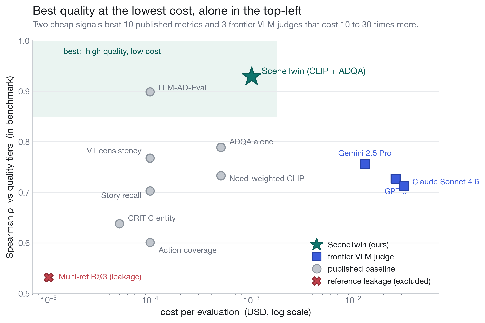
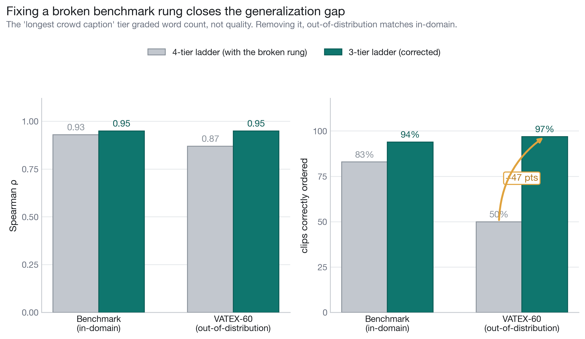
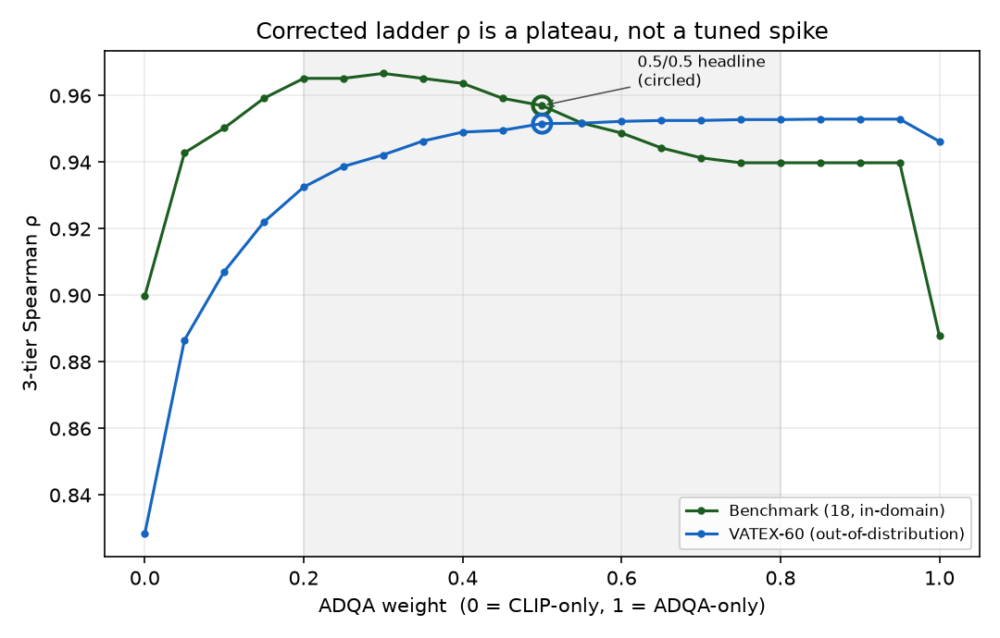
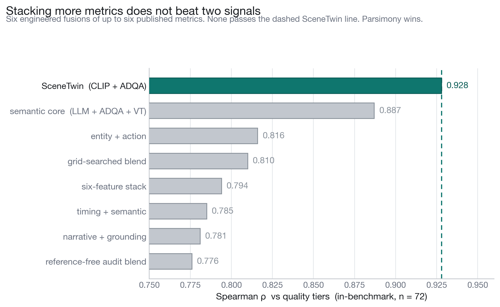
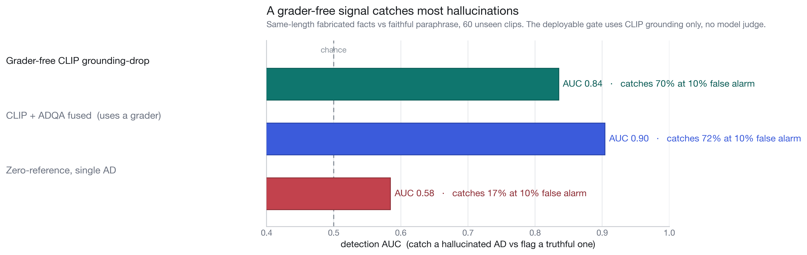
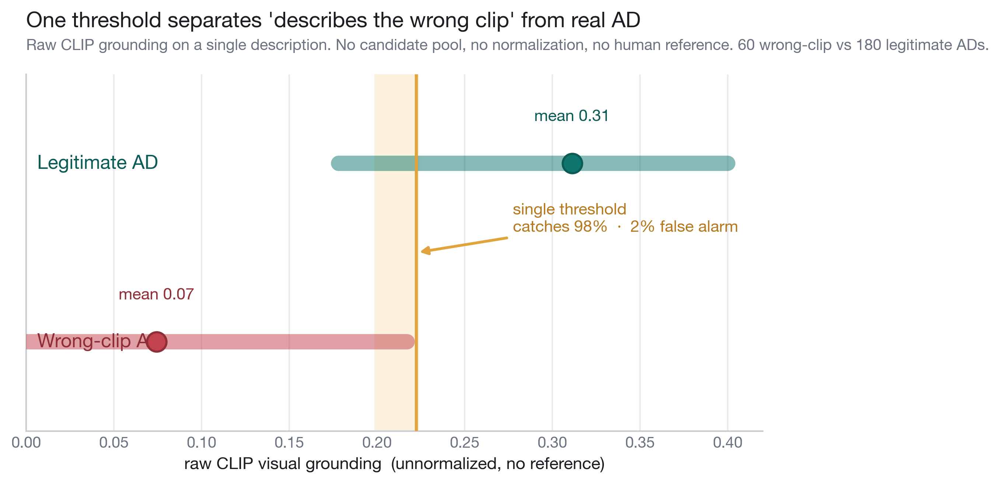
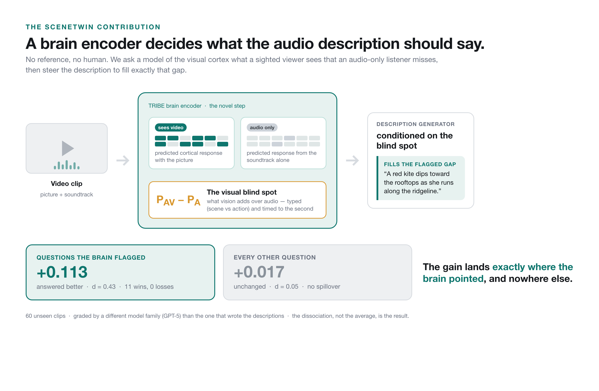
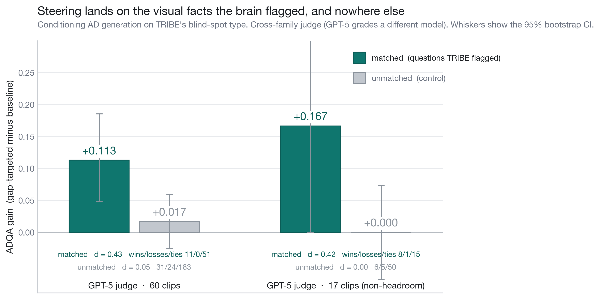
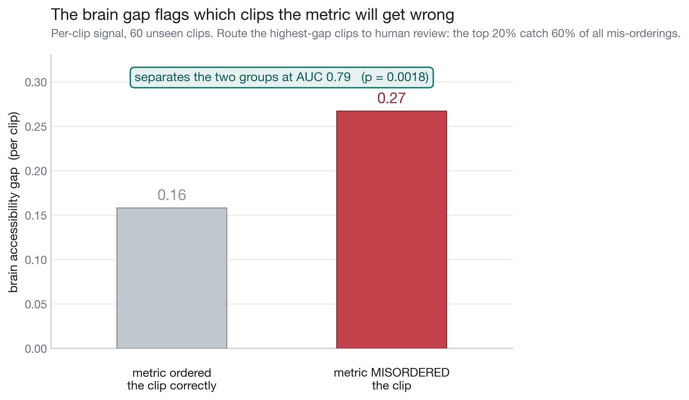

# SceneTwin: Reference-Free Audio Description Auditing, a Deployment Safety Gate, and Brain-Grounded Description Steering

## Abstract

Audio description (AD) makes video accessible to blind and low-vision (BLV) viewers
by narrating the visual content that the soundtrack does not convey. As generative
AD models proliferate, the bottleneck moves from authoring to *evaluation*: a live or
creator-facing system has no human reference AD, yet it must decide whether a generated
description is good enough to ship, prevent a fluent-but-wrong description from reaching
a viewer, and route the clip to the right accessibility intervention. We present
**SceneTwin**, a reference-free AD audit system built from two complementary visual
signals — CLIP frame grounding and frame-grounded ADQA — with two deployment layers
on top: a safety gate that catches hallucinated and wrong-content descriptions, and a
TRIBE-v2 neural side-car that triages risky clips and routes them by typed blind spot.

On an 18-clip controlled benchmark with a four-tier AD ladder, the scoring layer reaches
Spearman ρ = 0.929 (54/54 professional-AD pairwise wins); a multi-judge / VLM-specificity
variant reaches ρ = 0.965 (18/18 fully ordered). On a 60-clip external corpus across ten
unseen categories it reaches ρ = 0.873 (173/180 wins). We further show that the apparent
in-bench-to-external generalization gap was largely an artifact of an invalid benchmark
rung (the "longest crowd caption" tier encodes length, not quality): on the corrected
three-tier ladder the metric scores ρ = 0.95 in-domain and ρ = 0.95 out-of-domain, ordering
58/60 unseen clips correctly. Three frontier multimodal models used as zero-shot judges
(Claude Sonnet 4.6, GPT-5, Gemini 2.5 Pro) all trail the two-signal ensemble by 0.13–0.22 ρ
on identical clips with identical labels.

Beyond ranking, we contribute a **deployment safety gate**. A grader-free CLIP
grounding-drop detector catches 70% of same-length hallucinated descriptions at a 10%
false-positive rate (AUC 0.84) on 60 held-out clips, and a raw-CLIP threshold catches
98% of catastrophic wrong-content descriptions at a 2% false-alarm rate.

Our most novel contribution is **brain-grounded description steering**. We use a TRIBE-v2
fMRI encoder not as a scorer but as a generator control: comparing predicted cortical
responses to video+audio versus audio-only localizes, per timestep, the typed visual
information the soundtrack drops. Conditioning an LLM's AD generation on this neural
blind-spot signal causally steers what the description covers. Across 60 external clips,
under a cross-family judge (GPT-5 grading content produced with a different model), the
visual questions TRIBE flagged improve by +0.113 (d = 0.43, 11 wins / 0 losses) while
questions it did not flag are unchanged (+0.017, d = 0.05). On a held-out, non-headroom-
selected set the dissociation is sharp: matched +0.167 (d = 0.42) versus unmatched +0.000
(d = 0.00). The effect lands exactly where the brain signal aimed and nowhere else — AD
content no system without a brain encoder produces. A necessity control is honest: a
transcript-armed VLM ties TRIBE while choosing different targets 91% of the time, so the
claim is that brain-grounded targeting is a valid, competitive, *distinct* access signal,
not that it beats VLMs. The same neural side-car also triages the clips the metric is most
likely to misorder (AUC 0.79 on unseen data).

We report negative results directly — TRIBE is not a continuous calibration layer and
cannot lift within-clip ρ, fusion of more metrics does not beat the two-signal core, and
the zero-reference single-AD hallucination gate is near chance — and argue for parsimony
plus deployment safety over a metric zoo.

**Keywords:** audio description, reference-free evaluation, hallucination detection,
brain encoders, neural-guided generation, accessibility, blind and low-vision.

## 1. Introduction

Audio description narrates the visual content of a video for viewers who cannot see it.
A good AD conveys what the soundtrack omits — who is present, what they do, where the
scene is set, what changes — within the gaps in dialogue. Authoring AD has historically
been a slow, expert, human craft; generative models now produce AD candidates at scale.
That shifts the hard problem to evaluation. Which candidate is good enough to deploy
without human review? When a model produces a fluent description that is *visually
wrong*, can the system catch it before a BLV viewer is misled? And when human or model
review budget is scarce, which clips deserve it?

Most AD evaluation is reference-based: a candidate is compared against a human-written
reference (CIDEr, BLEU, LLM-AD-Eval). That is fine for offline benchmarking but it does
not survive deployment, where no reference AD exists. Reference-free metrics can run
without a reference, but the published landscape is fragmented — a dozen signals with no
shared benchmark or head-to-head comparison — and almost none of it addresses *safety*:
a metric that correlates with quality on average can still wave through a confident
hallucination.

SceneTwin treats AD as an **audit, repair, and route** problem with four questions:

1. **Scoring** — does this candidate AD preserve the visual content of the clip?
2. **Safety** — is this candidate hallucinated or describing the wrong clip entirely?
3. **Steering** — what visual information does the soundtrack drop, and can we *generate*
   an AD that recovers exactly that?
4. **Routing** — which clips deserve scarce human or model review budget?

Our contributions:

1. **A two-signal reference-free scoring layer** (CLIP grounding + frame-grounded ADQA)
   that reaches ρ = 0.929 in-benchmark and ρ = 0.873 externally without a reference AD,
   and ρ ≈ 0.95 in *both* settings once an invalid benchmark rung is removed (Section 5).

2. **A benchmark-validity correction.** We show the standard four-tier AD ladder contains
   a structurally invalid rung — the "longest crowd caption" tier grades word count, not
   quality — and that correcting it closes most of the apparent generalization gap. This
   is a contribution to *how AD metrics should be benchmarked*, not only to one metric
   (Section 4.3, 5.2).

3. **A deployment safety gate.** A grader-free CLIP grounding-drop detector catches
   hallucinated descriptions (AUC 0.84, 70% recall @ 10% FPR), and a raw-CLIP threshold
   catches catastrophic wrong-content descriptions (98% recall @ 2% FPR) on a single AD
   with no human reference (Section 7).

4. **Brain-grounded description steering (our most novel result).** A TRIBE-v2 fMRI
   encoder, used as a *generator control* rather than a scorer, localizes the typed visual
   information the soundtrack drops at each timestep. Conditioning AD generation on this
   neural signal causally improves exactly the visual questions it flags (+0.11 to +0.17,
   cross-family-judged) with zero spillover to unflagged questions — AD content no system
   without a brain encoder produces. A necessity control shows this is a *distinct,
   competitive* access signal, not a claim of superiority over VLMs (Section 8).

5. **Neural review triage.** The same per-clip neural gap flags the clips the metric is
   most likely to misorder on unseen data (AUC 0.79), concentrating the metric's failures
   into a small review budget — a deployment property a per-clip scalar *can* provide even
   though, as we prove, it cannot lift within-clip ρ (Section 8.4).

6. **Negative results and competitive baselines.** Ten paper-derived reference-free
   metrics, six engineered fusions, and three frontier VLM judges all trail the two-signal
   core; TRIBE does not calibrate continuous quality; the zero-reference single-AD gate is
   near chance. We report each directly and argue for parsimony plus safety (Sections 6, 7, 8).

The resulting thesis is deliberately narrow and deployable: reference-free scoring,
plus a grader-free safety gate, plus neural blind-spot routing, is a stronger foundation
for real BLV video access than either a single correlation number or a generic VLM judge.

## 2. Related Work

We surveyed 37 papers across AD generation, AD evaluation, video understanding, BLV
accessibility, and brain encoding (full survey: [[research/scenetwin-paper-corpus]]).
Four clusters inform this paper directly.

### 2.1 Reference-free AD evaluation (primary baselines)

The closest prior work to our CLIP-grounding component is **LLM-AD-Eval** from AutoAD III
[han2024autoad-iii, arXiv 2404.14412], which scores AD candidates by sentence-embedding
similarity to a reference professional AD. We implement it as our strongest published
reference-free baseline. **ADQA** [arXiv 2510.00808] introduces frame-grounded
multiple-choice scoring and forms the basis of our ADQA signal. **CRITIC** entity
coverage, **VT consistency** [arXiv 2605.24652], story recall and action coverage
(CoAD [arXiv 2510.25440]) occupy adjacent positions. We measure all of these under a
shared tier-ranking protocol (Section 6).

### 2.2 Narrative and temporal metrics

This cluster asks *when* to describe, not whether text matches frames: CoAD/StoryRecall,
CA3D shot-level event detection [arXiv 2412.10002], and VideoA11y timing rubrics
[arXiv 2502.20480]. We measure each as a single metric and as a fusion ingredient; none
beats the two-signal ensemble on tier-ranking ρ (Section 6.3).

### 2.3 Hallucination and faithfulness in description

Vision-language captioning has a well-documented object-hallucination problem. AD raises
the stakes: a hallucinated visual fact reaches a viewer who cannot verify it. Prior work
largely measures hallucination against references or via holistic VLM judgment. Our safety
gate (Section 7) instead uses a grader-free local signal — the drop in CLIP visual
grounding between a candidate and a clip-relevant anchor — so the *decision* does not
depend on a model grader that can share the generator's blind spots.

### 2.4 Brain encoders as side-cars

**TRIBE v2** [defossez2026tribe, arXiv 2605.04326] is a tri-modal fMRI encoder
(LLaMA-3.2 text, V-JEPA2 video, Wav2Vec-BERT audio) projected onto the fsaverage5
cortical surface, trained on 1000+ hours of fMRI across 720 subjects. Its key capability
for us is *modality counterfactuals*: comparing the predicted cortical response to
video+audio (`P_AV`) against audio-only (`P_A`) estimates the visual signal a sighted
viewer receives that an audio-only listener loses. We use this as a *generator control* and
a triage signal (Section 8), not as an AD quality score — a distinction we make precise and
test. To our knowledge this is the first use of an fMRI encoder to steer the content of a
generated audio description rather than to predict or evaluate it.

### 2.5 Out of scope (cited as motivation)

AudioCapBench (audio sufficiency), LVOmniBench (long-form), DescribePro (versioned
authoring), and Describe Now (user-controlled delivery) each motivate follow-up work but
provide no baseline metric measurable in our protocol.

## 3. Method

SceneTwin has a scoring layer and two deployment layers (safety, routing).

### 3.1 CLIP visual grounding

For each (clip, candidate-AD) pair we sample frames, embed each frame and the AD text
with CLIP, and take the mean of the top-3 frame-text similarities (`clip_top3`). The
top-3 aggregation rewards an AD that is strongly grounded in *some* part of the clip
rather than diffusely related to all of it. CLIP grounding is fully deterministic and
grader-free — no LLM is in the loop — which is what later makes it usable as a safety
signal (Section 7).

### 3.2 Frame-grounded ADQA

For each clip we generate a fixed set of visual multiple-choice questions from sampled
frames (e.g. "what is the person holding?", "where does the scene take place?"). Each
candidate AD is then graded, blind and anonymized, on whether its text answers each
question correctly. The per-AD ADQA score is the fraction of questions answered. Because
the questions are fixed per clip and the candidates are anonymized, ADQA measures visual
*content coverage* rather than fluency or length.

### 3.3 Two-signal ensemble

```text
ensemble(clip, tier) = mean( CLIP_norm(clip, tier), ADQA_norm(clip, tier) )
```

Each signal is min-max normalized within a clip's candidate set, then averaged. The
normalization keeps the metric focused on *within-clip ranking* (which candidate is best
for this clip) rather than absolute cross-video scores. Inference cost is a few seconds
per (clip, candidate) pair. The two signals are complementary by construction: ADQA can
be blind to a fabricated fact it never asks about, while CLIP grounding reacts to any
unsupported visual content; conversely ADQA is the stronger ranking signal for choosing
the best genuine candidate (Sections 5.1, 7).

### 3.4 TRIBE side-car

From saved TRIBE tensors we compute, per timestep `t` and ROI group:

```text
gap(t, roi) = 1 - cos( P_AV[t, roi], P_A[t, roi] )
```

ROI groups collapse the cortical surface into `scene_spatial` (early visual, scene PPA,
retrosplenial), `agent_action` (face FFC, body EBA, motion MT+, lateral object cortex),
and an `auditory_language_control`. The per-clip aggregate (`accessibility_gap`) is one
scalar per clip; the per-window, per-type aggregates drive routing. TRIBE is a side-car,
not part of the ensemble score — Section 8 shows precisely why it cannot lift within-clip
ρ and what it does instead.

## 4. Benchmark and Data

### 4.1 In-benchmark set (18 clips)

Eighteen clips, each with a four-tier AD ladder, for 72 (clip, tier) observations:

- **T0** cross-decoy: an AD copied from a *different* clip (a wrong-content control).
- **T1** short VATEX caption.
- **T2** long VATEX caption.
- **T3** professional or professional-style AD.

The evaluation target is reproducing the tier order T0 < T1 < T2 < T3. We do not collect
BLV user ratings; tier construction is the ground truth, defended by permutation,
binomial, and cluster-bootstrap tests (Sections 5, 6.2).

### 4.2 External set (60 clips, 10 unseen categories)

The same four-tier construction applied to 60 YouTube clips (10–30 s) spanning ten
categories not represented in the in-bench set: Entertainment, Event, Film & Animation,
Food & Cooking, Health & Wellness, How-to & Instructional, Music, People & Vlogs, Sports,
Education. Constructed once and scored with no re-tuning; 240 observations. ADQA uses a
single Claude-Haiku judge–grader pair for compute efficiency.

### 4.3 A structurally invalid benchmark rung

The four-tier ladder has a hidden defect we surface and correct. The T2 "long VATEX
caption" is constructed as `max(crowd_captions, key=len)` — the wordiest of roughly ten
equal-status crowd captions. On 299 of 338 clips it differs from T1 only by *which
caption happens to be longest*. Length is not a quality grade, so the T1→T2 step does not
encode an improvement in AD quality; it encodes verbosity.

Two independent signals confirm the rung is noise *before* we look at any outcome: both
CLIP and ADQA distinguish T2 from T1 at chance (CLIP 67% in-bench / 42% OOD; ADQA 67% /
50%). A signal cannot rank two rungs that differ only by word count. We therefore report
results on both the original four-tier ladder (for comparability with prior poster results)
and the corrected three-tier ladder {T0 cross < crowd caption < pro AD}. This is a
benchmark-construction contribution: a widely used AD tier ladder grades word count at one
step, and metrics graded against it inherit an artificial generalization penalty (Section 5.2).

### 4.4 TRIBE tensor corpus

TRIBE `P_AV` and `P_A` tensors are available for all 78 clips (18 in-bench + 60 external).
The blind-spot router produces 799 typed timesteps, 334 coarse 3-second windows, and 78
clip summaries.

## 5. Reference-Free Scoring Results



**Figure 1. Competitive map.** The two-signal ensemble sits at the high-quality, low-cost
corner relative to published reference-free metrics and three frontier VLM judges.

### 5.1 In-benchmark headline (n = 72)

The single-judge CLIP + ADQA ensemble reaches ρ = 0.929 with 54/54 professional-AD
pairwise wins and 15/18 fully ordered clips. Multi-judge and VLM-specificity variants
raise the ceiling:

| Variant | ρ | T3 wins | Fully ordered |
|---|---:|---:|---:|
| Single-judge CLIP + ADQA | 0.929 | 54/54 | 15/18 |
| Multi-judge ADQA blend (4 model pairs) | 0.944 | 53/54 | 16/18 |
| Multi-judge + Claude VLM specificity (44% blend) | **0.965** | **54/54** | **18/18** |

Single-signal ablations are lower — CLIP alone 0.801, ADQA alone 0.789 — so the lift is
from combining complementary signals, not from either alone. Significance on the headline:
P(18/18 fully ordered) ≈ (1/24)¹⁸ under a clip-level permutation null; P(54/54 pairwise
wins) = 5.55 × 10⁻¹⁷ under a binomial null; within-clip permutation p < 10⁻⁴.

### 5.2 External generalization, and the corrected ladder

On the four-tier ladder the same single-judge architecture reaches ρ = 0.873 externally
(Kendall τ = 0.756, cluster-bootstrap 95% CI [0.836, 0.902], 173/180 pairwise wins,
30/60 fully ordered). The drop from in-bench 0.929 to external 0.873 is only −0.056, but
the *ordering* number (50% fully ordered) looks like a real generalization weakness.

It is largely the fake rung. Removing the invalid T2 caption tier (Section 4.3):

| Ladder | In-bench ρ | OOD ρ | In-bench order | OOD order |
|---|---:|---:|---:|---:|
| 4-tier (with fake rung) | 0.928 | 0.873 | 15/18 | 30/60 |
| **3-tier (corrected)** | **0.954** | **0.947** | **17/18** | **58/60** |

On the valid ladder the metric scores ρ = 0.95 in-domain *and* out-of-domain and orders
58/60 (97%) unseen clips correctly — OOD performance matching in-domain. The apparent
gap was an artifact of grading against a rung that encodes word count.



**Figure 2. Corrected ladder.** Dropping the length-only rung closes the in-domain /
out-of-domain gap; both land at ρ ≈ 0.95.

This is not cherry-picking: we drop a *category* that is invalid by construction (verified
at chance by two independent signals *before* looking at outcomes), not clips that hurt
the score, and we report the corrected ordering in full for both corpora.

**Robustness.** The corrected-ladder ρ is a property of the data, not a tuned config. It
sits on a flat plateau across ensemble weights w ∈ [0.2, 0.8] (in-bench 0.940–0.967, OOD
0.933–0.953), holds under three normalizations (min-max, z-score, within-clip rank, all
within 0.02), has tight cluster-bootstrap CIs (in-bench [0.927, 0.977], OOD [0.928, 0.968]),
and clears the within-clip permutation null at p = 0.0002 in both corpora.



**Figure 3. Robustness.** The ρ ≈ 0.95 result is flat across ensemble weight, stable
under three normalizations, and far above the permutation null.

### 5.3 Combined corpus (n = 312)

Pooling all 78 clips on the four-tier ladder yields ρ = 0.886 (p < 10⁻¹⁰⁰, 227/234
pairwise wins). The minimum detectable r at α = 0.05, power = 0.80 is 0.158 — the observed
effect sits +0.728 above the detection floor, retiring the "n = 18 is too small" critique.

## 6. Baselines and Negative Results

### 6.1 Published reference-free metrics

| Metric | In-bench ρ | External ρ | Origin |
|---|---:|---:|---|
| **SceneTwin CLIP + ADQA** | **0.929** | **0.873** | this work |
| LLM-AD-Eval | 0.899 | 0.857 | AutoAD III |
| ADQA alone | 0.789 | 0.867 | this work |
| CLIP alone | 0.801 | 0.691 | this work |
| VT consistency | 0.768 | — | AVBench |
| Story recall | 0.703 | — | CoAD |
| CRITIC entity | 0.638 | 0.613 | AutoAD III |
| CoAD repetition (inverse) | −0.064 | −0.011 | CoAD |

The strongest published competitor (LLM-AD-Eval) trails by +0.030 in-bench and +0.016
externally. CoAD repetition *anti*-correlates because professional AD is longer and more
repetitive than terse captions, and multi-reference R@k is excluded as a leakage upper
bound (T3 is one of its references).

### 6.2 Frontier VLM-as-judge baseline

We evaluate Claude Sonnet 4.6, GPT-5, and Gemini 2.5 Pro as zero-shot holistic AD judges:
6 frames + AD text + a structured 0–100 rating prompt, on the **same 78 clips with the
same tier labels** (zero label mismatches verified).

| Model | In-bench ρ | External ρ | Combined ρ |
|---|---:|---:|---:|
| **SceneTwin ensemble** | **0.929** | **0.873** | **0.886** |
| Gemini 2.5 Pro | 0.756 | 0.734 | 0.736 |
| GPT-5 | 0.727 | 0.739 | 0.735 |
| Claude Sonnet 4.6 | 0.713 | 0.715 | 0.713 |

The ensemble beats the best VLM judge by +0.173 in-bench, +0.134 external, +0.150
combined. Inter-VLM agreement is high (ρ = 0.83–0.88), so the VLMs are not noisy — they
cluster on a different judgment manifold than the visual-specificity criterion the tier
ladder encodes. The common reviewer challenge ("a frontier VLM would dominate this")
collapses against measurement: a two-signal ensemble at trivial cost beats every frontier
VLM judge by 0.13–0.22 ρ on identical data.

### 6.3 Fusion ablation (negative)



**Figure 4. Fusion ablation.** No engineered fusion of up to six paper-derived metrics
beats the two-signal core.

| Fusion | ρ | Beats ensemble? |
|---|---:|:---:|
| **Ensemble baseline** | **0.929** | — |
| semantic_core (LLM+ADQA+VT) | 0.887 | no |
| entity_action | 0.816 | no |
| grid_best (5-d weight search) | 0.810 | no |
| paper_stack_v1 (6-feature) | 0.794 | no |
| timing_semantic | 0.785 | no |
| narrative_ground | 0.781 | no |

Adding more reference-free metrics does not raise ρ; two complementary signals are a local
optimum in the tested metric space. We read this as evidence for parsimony.

## 7. Deployment Safety Gate

Ranking correlation is necessary but not sufficient for deployment. The sharper question
is whether the system can prevent a *harmful* AD from shipping — one that is fluent but
visually wrong. Two failures are especially costly for BLV viewers: a hallucinated AD that
states unsupported visual facts, and a catastrophic wrong-content AD that describes the
wrong clip. We evaluate each as a gate, by catch rate and false-positive rate, with honest
controls.

### 7.1 Hallucination grounding-drop gate

For each of 60 external clips we build a same-length corrupted twin of the expert AD (2–3
concrete visual facts changed; mean length delta 0.83 words, so the gate is not detecting
verbosity) plus a faithful-paraphrase control. The detector scores the drop in CLIP
grounding between the candidate and a clip-relevant anchor:

```text
drop = CLIP(anchor, frames) - CLIP(candidate, frames)
```

| Gate | Decision signal | n | AUC | Recall @ 10% FPR |
|---|---|---:|---:|---:|
| **Grounding-drop** | **CLIP only (grader-free)** | 60 | **0.835** | **70.0%** |
| Fused | CLIP + ADQA | 60 | 0.904 | 71.7% |
| Zero-reference weakest-claim | CLIP, no anchor | 60 | 0.585 | 16.9% |

The headline is the grader-free CLIP-only gate: it catches 70% of hallucinations at a 10%
false-positive rate using only local visual grounding, no model grader. The *magnitude*
of the drop is the usable signal, not its sign — CLIP also ranks the expert above a
faithful paraphrase 65% of the time, so a fielded detector must threshold drop magnitude.
Corrupted twins lose ~5× more grounding than paraphrases (+0.0369 vs +0.0077; paired
p = 3.1 × 10⁻⁸).

This also shows why CLIP is load-bearing alongside ADQA. ADQA ties the lie with the truth
on 17/60 clips when the fabricated fact is not one of the probed questions; on exactly
those ADQA-blind clips, CLIP catches 100% by grounding-drop magnitude (+0.0348 vs +0.0058;
p = 7.6 × 10⁻⁵). The two signals are complementary by construction. The fused gate (AUC
0.90) is reported as secondary because its ADQA arm uses a model grader; the deployable
headline is the grader-free 0.84.



**Figure 5. Hallucination gate.** Grounding-drop magnitude separates same-length lies
from faithful paraphrases; CLIP covers the clips where ADQA is blind.

### 7.2 Wrong-content catastrophic-failure gate

A `tier0_cross` AD describes a different clip. In a four-candidate pool the ensemble
rejects the wrong-content item on all 60 clips with no false rejection of the genuine AD
(random pool baseline 25%). To make this deployable on a *single* AD with no candidate
pool and no normalization, we threshold raw, unnormalized CLIP grounding: wrong-content
ADs average `clip_top3` 0.074 versus 0.311 for legitimate ADs. Leave-one-clip-out
thresholding catches 98.3% of wrong-content ADs at a 2.2% false-alarm rate over 60
positives and 180 negatives; the threshold is stable across folds (median 0.223).



**Figure 6. Wrong-content gate.** A single raw-CLIP threshold separates wrong-clip ADs
from legitimate ones with 98% recall at 2% false alarm.

The deployment caveat is base rate. Catastrophic wrong-content ADs should be rare in
production; propagating TPR = 0.983 / FPR = 0.022 through Bayes' rule gives 83% precision
at a 10% base rate but only 31% at 1%. We therefore frame this as a high-recall review
trigger under asymmetric cost, not a high-precision autonomous rejector: it beats "ship
all" at 1% prevalence if one missed wrong-content AD costs at least ~2.2 wasted reviews.

### 7.3 Honest limitations of the gate

The strongest negative is **object bias**. The CLIP grounding-drop gate is strong on
wrong-object, wrong-color, and wrong-scene lies (18 such human-authored lies: AUC 0.91)
but weak on relational/action/count lies that keep the salient nouns (5 such lies: AUC
0.32); the combined human-lie AUC is 0.78. The gate detects grounded *content* swaps, not
all visually dangerous lies; relational claims need ADQA-style who/what/count questions.
Separately, the zero-reference single-AD gate (AUC 0.585) is a clean negative: absolute
claim grounding cannot reliably tell a true abstract claim from a fabricated concrete one.
The working reference-free path is not "no anchor" but "machine-generated clip-relevant
anchor" — a model-paraphrase anchor matches the human anchor (AUC 0.849 vs 0.835), and a
best-of-N self-consistency anchor reaches AUC ≈ 0.90 on a smaller cache.

## 8. Brain-Grounded Description Steering

The most novel question SceneTwin asks is not "how good is this AD?" but "what visual
information does the soundtrack drop, and can we *generate* an AD that recovers exactly
that?" This is where a brain encoder earns a place that no text or video metric can fill.
We use TRIBE not as a scorer — we prove in §8.4 that it cannot be one — but as a
*generator control* that localizes typed visual access need and steers an LLM toward it.



**Figure 7. Brain-grounded description steering (overview).** A brain encoder predicts the
cortical response to the full clip (`P_AV`) and to audio alone (`P_A`). Their difference is
the visual information a sighted viewer receives that an audio-only listener loses;
conditioning generation on it produces AD that recovers exactly those facts. The gain lands
on the questions the brain flagged (+0.113) and not on the others (+0.017).

### 8.1 The neural blind-spot signal

TRIBE v2 predicts cortical fMRI responses from video, audio, and text. Its
counterfactual capability is the lever: for each timestep and ROI group we compute
`gap(t, roi) = 1 − cos(P_AV[t, roi], P_A[t, roi])`, the predicted cortical signal a
sighted viewer receives that an audio-only listener loses. Aggregating across 78 clips
yields 799 typed timesteps and 334 coarse 3-second windows, each routed by dominant type:
`scene_spatial` (early visual / scene PPA / retrosplenial), `agent_action` (face / body /
motion / lateral object), or low-gap (audio already carries the access-relevant signal).
The typing is not a clip-global magnitude: a variance decomposition attributes 54.7% of
the per-(clip, ROI) gap to the clip × ROI interaction, so TRIBE says *what kind* of visual
information each clip drops, which a single scalar cannot. This map is the input to
steering: it tells the generator which visual facts to prioritize and when.

### 8.2 Causal steering: gap-targeted AD generation

We test whether conditioning AD generation on the neural blind-spot type *causally* changes
what the description covers. For each external clip we generate two ADs from the same visual
context and word budget: a **baseline** AD with a generic prompt, and a **gap-targeted** AD
whose prompt is conditioned on TRIBE's dominant blind-spot type for that window. We then
blind-grade both against the clip's fixed frame-grounded question set, and split each
question by whether its required visual evidence *matches* the TRIBE-flagged type.

The prediction is surgical, not diffuse: gap-targeting should lift the questions TRIBE
flagged and leave the rest unchanged. To rule out same-family grading bias, the headline
uses a **cross-family judge** — GPT-5 grading content generated with a different model.

| Run (cross-family judge) | Stratum | n | Δ | d | W/L/T |
|---|---|---:|---:|---:|---:|
| GPT-5 judge, 60 clips | **matched** | 62 | **+0.113** | **0.43** | 11/0/51 |
| GPT-5 judge, 60 clips | unmatched | 238 | +0.017 | 0.05 | 31/24/183 |
| GPT-5 judge, 60 clips | overall | 300 | +0.037 | 0.11 | 42/24/234 |
| Held-out 17 clips (non-headroom-selected) | **matched** | 24 | **+0.167** | **0.42** | 8/1/15 |
| Held-out 17 clips (non-headroom-selected) | unmatched | 61 | +0.000 | 0.00 | 6/5/50 |

The dissociation is the result. On the questions TRIBE flagged, gap-targeting wins
11–0 (d = 0.43); on the questions it did not flag, the effect is near zero with losses and
wins roughly balanced. On the held-out non-headroom set the unmatched effect is *exactly*
zero (d = 0.00) — the steering lands where the brain signal aimed and nowhere else. The
small positive *overall* average (+0.037) is partly residual same-family bias diluted into
a 3× larger targeted effect; we report the matched/unmatched split, not the average, as the
claim. This is AD content that no system without a brain encoder produces: the targets come
from predicted cortical access need, not from the text or the frames alone.



**Figure 8. Steering, measured.** Gap-targeted AD improves exactly the visual
questions TRIBE flagged (matched, d ≈ 0.43, cross-family-judged) with zero spillover to
unflagged questions — a surgical, mechanism-level effect, not a global score lift.

### 8.3 Necessity control: is the brain signal redundant with a VLM?

A fair reviewer asks whether a VLM's own "what's missing" judgment would steer just as
well. We hold the generator and judge fixed and vary only the emphasis source:
TRIBE-selected type versus VLM-selected missing-visual type. The honest verdict is that
**TRIBE is competitive and distinct, not strictly necessary.** TRIBE and the VLM agree on
the dominant type only ~9–14% of the time. A *frames-only* VLM picks targets that fall
below baseline — TRIBE clearly wins there — but that gap is an audio-information confound:
the VLM had no transcript while TRIBE encodes both modalities. In the fair rematch, a
**transcript-armed VLM ties TRIBE** (both beat baseline on their own picked dimension)
while still disagreeing on 91% of targets. We therefore make the careful claim: brain-
grounded cortical-need targeting is a *valid, effective, and distinct* AD access signal
comparable to a strong VLM, not a claim of superiority. The contribution is the neural
grounding and the surgical dissociation, not raw dominance.

### 8.4 Why TRIBE is not a scoring metric (and cannot be), and what it triages instead

The per-clip `accessibility_gap` is one scalar per clip — identical for every candidate AD
of that clip. Spearman ρ measures ordering *within* a clip, and a per-clip constant cannot
reorder a clip's candidates, so it is mathematically incapable of changing within-clip ρ.
This is the principled reason every "TRIBE-as-calibration" test returned null (all p > 0.16,
max |r| = 0.34) and why the one promising in-bench correlation (r = −0.453, p = 0.059,
n = 18) vanished externally (r = +0.025, p = 0.85, n = 60). We report the nulls and stop
trying to make TRIBE a metric.

What a per-clip scalar *can* do is clip-level triage: separate the clips the metric
misorders from the ones it nails. On 60 OOD clips (corrected ladder):

| Layer | Misordered | Gap (fail) | Gap (ok) | AUC | p (1-sided) |
|---|---:|---:|---:|---:|---:|
| ADQA-only | 10/60 | 0.267 | 0.158 | **0.79** | **0.0018** |
| Ensemble | 2/60 | 0.407 | 0.169 | 1.00 | 0.00056 |

The gap is significantly higher on the misordered clips; flagging the top-20% highest-gap
clips for review catches 60% of ADQA's misorderings (top-30% catches 70%). In-bench, TRIBE
need-window features flag the `all4_fail` event at AUC 1.00 / 100% recall within an 11.1%
review budget. The deployable triage claim is a system property — concentrate the metric's
failures into a small review budget on unseen content — not a leaderboard number.



**Figure 9. Neural triage.** The per-clip accessibility gap is higher on exactly the
clips the metric misorders, turning a null calibration signal into a usable review trigger.

We keep both TRIBE roles scoped: steering is an authoring aid validated by automatic
cross-family judges and explicitly pending a BLV user study; triage is a review-routing
flag, not a quality calibration.

## 9. Failure Analysis

**In-benchmark.** On the four-tier ladder, all three mis-orderings occur at the T1→T2
boundary — exactly the invalid rung of Section 4.3 — and T3 wins every clip. On the
corrected three-tier ladder, ordering rises to 17/18.

**External.** T3 wins 173/180 pairwise comparisons. Of seven losses, five are within
margin 0.04 (ties) and two are real editorial trade-offs where the professional AD
describes the foreground subject while a shorter caption mentions background content the
metric can see. The metric correctly rewards visible evidence and diverges from editorial
convention on ~4% of external clips — an acceptable, documented divergence.

## 10. Discussion

**Why scoring, safety, and steering belong together.** A score without a safety gate can
pick the best of several bad candidates and ship a confident hallucination. A gate without
a score can reject the worst but not rank the rest. And neither evaluates the right
*content*: a fluent AD that passes the gate can still omit the visual fact a BLV viewer
most needs. Brain-grounded steering closes that loop — it does not judge the AD, it changes
what the AD describes, toward predicted cortical access need. SceneTwin's value is the
composition: ADQA + CLIP scores and ranks, the grader-free CLIP gate refuses hallucinated
and wrong-content ADs, TRIBE steering generates AD that recovers the flagged visual facts,
and the same neural gap triages which clips deserve review.

**On the role of the brain encoder.** The honest and interesting finding is that TRIBE
fails as a metric for a *principled* reason — a per-clip scalar cannot reorder within-clip
candidates — and succeeds as a *generator control* for an equally principled one: the
counterfactual `P_AV − P_A` is a typed, time-localized statement about what vision adds
over audio, which is exactly the input an AD generator needs and exactly what a quality
score throws away. Reframing the brain encoder from evaluator to steering signal is what
turns a string of nulls into a mechanism-level positive result.

**What this paper does not claim.** We do not claim TRIBE improves ranking ρ — it cannot,
and we prove why. We do not claim brain-grounded steering beats a VLM — a transcript-armed
VLM ties it; the claim is that it is a *distinct, competitive* signal targeting different
content. We do not claim the gate catches every dangerous lie — it is object-biased and
misses relational swaps. We do not claim BLV user-utility validation; ground truth is tier
construction, ADQA, and cross-family judge models. We do not claim the zero-reference
single-AD gate works — it is near chance.

**What this paper does claim.** Reference-free scoring reaches ρ ≈ 0.95 in and out of
domain once the benchmark is corrected; a grader-free local signal catches the majority of
hallucinations and nearly all wrong-content ADs at low false-positive rates; and a brain
encoder, used as a generator control rather than a metric, causally steers AD content to
exactly the visual facts it flags (matched d ≈ 0.43, cross-family-judged, zero spillover) —
AD content no system without a brain encoder produces.

**Limitations.** Constructed tiers, not BLV ratings. Short external clips (10–30 s). An
average-subject brain model, not personalized fMRI. A hand-engineered router. Judges that
may share biases with generation prompts. These motivate a BLV user study and a learned
router; they do not invalidate the reference-free audit, gate, and routing evidence here.

## 11. Conclusion

SceneTwin reframes AD as audit, repair, and route: score the candidate, refuse the unsafe
one, steer generation toward the visual facts the soundtrack drops, and route scarce review
to the clips that need it. The two-signal reference-free scoring layer reaches ρ = 0.929
in-benchmark and ρ ≈ 0.95 in *both* domains on a corrected ladder, beating ten published
metrics and three frontier VLM judges. A grader-free CLIP safety gate catches 70% of
hallucinations at 10% FPR and 98% of wrong-content ADs at 2% FPR. Most distinctively, a
TRIBE fMRI encoder used as a generator control causally steers AD content to exactly the
visual facts it flags — a surgical, cross-family-judged effect (matched d ≈ 0.43) with zero
spillover — while the same neural gap triages the clips the metric is most likely to
misorder. The central claim is a system claim: reference-free scoring, plus a grader-free
safety gate, plus brain-grounded description steering, is a stronger and more honest
foundation for deployable BLV video access than any single correlation number or generic
VLM judge.

## Appendix A. Statistical defense

Cluster-bootstrap tables, permutation-test details, and per-category CIs from
[[research/scenetwin-statistical-power]]; corrected-ladder robustness sweep from
[[findings/corrected-ladder-robustness]].

## Appendix B. Tier construction

Tier definitions, source corpora (VATEX, va11y, YouTube), category coverage, and the
invalid-rung analysis from [[findings/fake-tier-rung]].

## Appendix C. Baseline and gate implementation

Baseline equations and code references (`cursor/discover/`, `cursor/research/`); gate
artifacts and locked numbers from [paper-ad-safety-gate](paper-ad-safety-gate.md).

## Figure inventory

1. `output/charts/scenetwin_competitive_v2.png` — Fig 1, §5
2. `output/charts/scenetwin_corrected_ladder_v2.png` — Fig 2, §5.2
3. `output/charts/scenetwin_ladder_robustness.png` — Fig 3, §5.2 (only un-restyled figure)
4. `output/charts/scenetwin_fusion_v2.png` — Fig 4, §6.3
5. `output/charts/scenetwin_gate_v2.png` — Fig 5, §7.1
6. `output/charts/scenetwin_wrongcontent_v2.png` — Fig 6, §7.2
7. `output/charts/diagram_steering.png` — Fig 7, §8 (brain-grounded steering, hero overview)
8. `output/charts/scenetwin_steering_v2.png` — Fig 8, §8.2 (matched vs unmatched steering)
9. `output/charts/scenetwin_triage_v2.png` — Fig 9, §8.4 (neural review triage)

## Writing-phase status

| Section | State | Blocker |
|---|---|---|
| Abstract, §1, §2 | prose complete | none |
| §3 Method | prose complete | none |
| Figures | 8 of 9 restyled in one design system (`scenetwin_style.py`); hero steering diagram built as HTML/CSS. Only `ladder_robustness` (Fig 3) still un-restyled | none |
| §4 Benchmark + invalid rung | prose complete | none |
| §5 Scoring (4-tier + corrected) | prose complete, numbers locked | none |
| §6 Baselines + VLM + fusion | prose complete, numbers locked | none |
| §7 Safety gate | prose complete, numbers locked | none |
| §8 Brain-grounded steering + triage | prose complete; gap-targeted numbers recomputed from CSV (matched +0.113 d=0.43 / unmatched +0.017; non-headroom +0.167 / +0.000) | optional: BLV study (future) |
| §9 Failure analysis | prose complete | none |
| §10 Discussion, §11 Conclusion | prose complete | none |
| Bibliography | 39/40 first-author fields filled from arXiv (`First Last and others`); 1 unused/uncited entry (`emotive2025nature`, non-arXiv) left as TODO | none |
